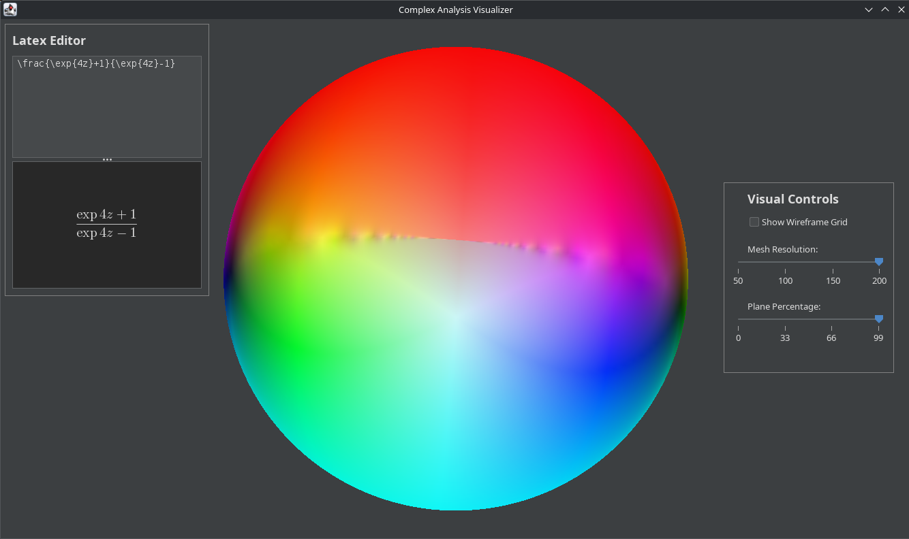

# Complex Visuals

A Java desktop application that renders 3D mathematical structures from complex analysis in an interactive way.
You can rotate and zoom in using the mouse, and use sliders/checkboxes to change settings in the control panel.

By using the in-built text editor, you can write mathematical expressions in LaTeX which render automatically, and use them to plot functions.

Both the control and editor panels can be moved by grabbing their name label.

## Features
* Interactive 3D visualization of a Riemann Sphere.
* Translucent interactive panels that can be dragged around.
* Adjustable mesh resolution and total plane percentage sliders.
* Toggleable wireframe grid overlay.
* LaTeX text editor, used to set the mapping of the Riemann Sphere.

## Libraries Used
* **Java:** As any other good java program.
* **Swing:** GUI and control panels.
* **Jzy3d:** 3D charting and rendering engine.
* **Matheclipse:** a Symja java symbolic math library.

## How to Run
Check the `Releases` section on the right and download the `.jar` file. However, you will need `Java 17` or a newer version of java to run it.

Otherwise, you can instead:
1. Clone this repository.
2. Ensure you have Java 17 and Maven installed.
3. Run the `Main` class to launch the app.